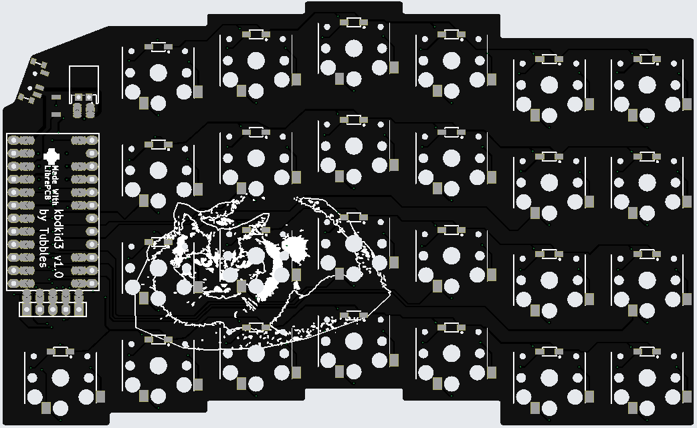

# kbdkid3

## Description

Ergo split wireless keyboard heavily inspired by [corne](https://github.com/foostan/crkbd), [brain](https://github.com/Wesztman/brain/tree/main), and [hillside](https://github.com/mmccoyd/hillside).

The images are of my cats, Loke and Boris.

## TODO

* The jumper solder pads have too wide spacing (currently 0.35 mm).
* The solder blobs from the jumper solder pads occupy precious real estate for the battery.
* the USB-C port of the nice!nano is impossible to use if the board is fully populated.
* Footprints of push-button and hotswap-socket should be widened, currently cannot be soldered easily by hand.
* The SMD diodes should be slightly closer to the switch, maybe 1 mm.
* The board could use disclaimer to mount the MCU upside down.
* The board needs mounting screw holes.
* Maybe add support for splitkbd tenting puck?
* Maybe lower the pinky column a bit?
* Maybe reduce the number of thumb keys?

## License

See [LICENSE.txt](LICENSE.txt).
